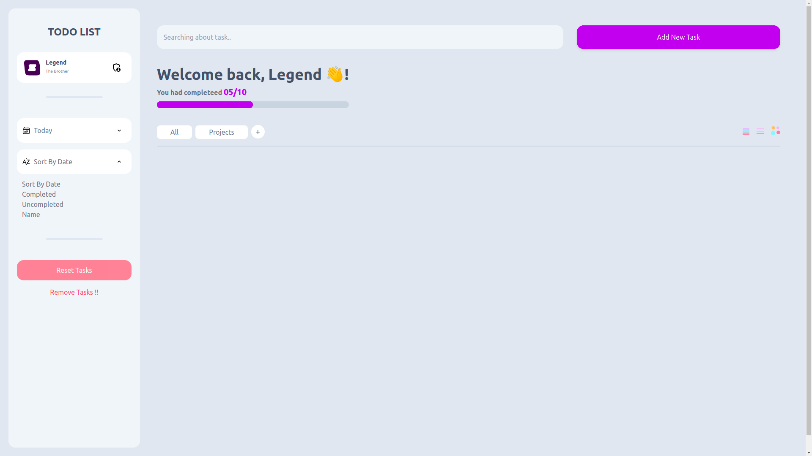

# TODO List
To-do list website - the place wehre you can manage your tasks (add new, remove one, update other) in organized way with the advanced user-freindly features that comes with;

## Technologies and tools

1. HTML5
2. CSS3
3. JavaSript
4. React, (useReducer + useContext)
5. Nextjs
6. Tailwindcss
7. Figma

## Features
It introduces us great user-freindly that helps
- Supports almost operation that you may need (add new, remove one, update other)
- Easy drag and drop
- Advanced tasks filtering
- Good-looking Custom selectors
- 

## Sources i used
