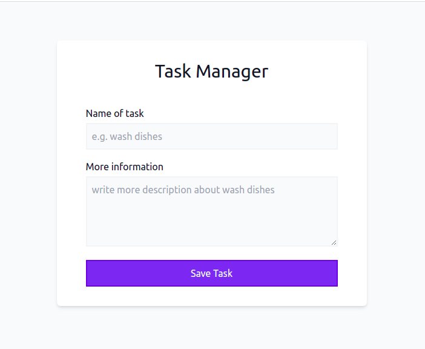

# OLD: Task manager

### My first back-end api and first fullstack app (ERN app);

## Languages and tools

1. HTML5
2. CSS3
3. JavaSript
4. React
5. Nextjs
6. Tailwindcss
7. Nodejs
8. Express.js

## Sources i used
The main source that i used is freeCodeCamp youtube channel, the great company. and John-smilga from Coding Addict is the great instructor that i the basics of node.js, npm, Express.js on its hand

- A Youtube Video: [Node.js / Express Course - Build 4 Projects](https://www.youtube.com/watch?v=qwfE7fSVaZM&t=319s&pp=ygUTNCBub2RlIGpzIHByb2plY3RzIA%3D%3D)
- A Youtube Video: [Node.js and Express.js - Full Course](https://www.youtube.com/watch?v=Oe421EPjeBE&t=138s&pp=ygUTNCBub2RlIGpzIHByb2plY3RzIA%3D%3D)
- Github repo that i used to compare my code with and alsoo to see the faults that may be i felt in. check out at: [node-express-course](https://github.com/john-smilga/node-express-course)

## OLD Word

- **BEFORE UPGRADING to - todo list - nextjs api routes** 
- "UPGRADING and recovering my knowledge on old projects, better than creating new projects with the same ideas .. boring, isn't it? as the goal is to have many repos.. 
- I'll use nextjs a
pi routes not becuase i didn't complete the app in express BUT just because to benfit more by this project in order to showc
ase my skills in nextjs, as i am a front-end even if nextjs makes me fullstack.. - I think i should thank nextjs for that by UPDARDING :))