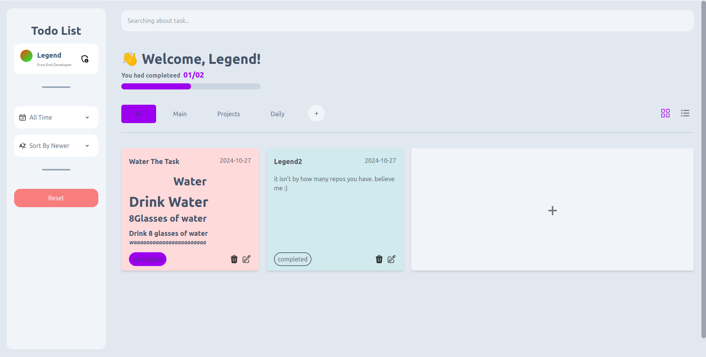

# Tod - Task Management Application

Tod is a user-friendly web application designed to help you save and manage your tasks efficiently. It features AI integration, allowing you to manage your tasks with Tod - a custom chatbot - in an easy and intuitive way.

## Features

- CRUD Operations with Redux Toolkit
- Add, edit, delete, and clear tasks
- Organize tasks by various options:
  - Creation date
  - Completion status
  - Name
- Filter tasks by different criteria:
  - Completed tasks
  - Uncompleted tasks
- Track your progress over time
- AI integration for smart task management
- Responsive design for various screen sizes
- User-friendly interface with customizable views

## Technologies and Tools

- HTML5
- CSS3
- JavaScript (ES6+)
- React
- Next.js
- Redux Toolkit
- Tailwind CSS
- Axios
- Marked (for Markdown rendering)
- File-Saver (for saving local version of current user data)

## Project Structure

The project follows a typical Next.js structure with additional organization for Redux and components:

- `src/`
  - `app/`: Next.js app directory
  - `components/`: React components
  - `assets/`: Static assets (images, icons)
  - `toolkits/`: Redux toolkit slices and store configuration
  - `utils/`: Utility functions
  - `hooks/`: Custom React hooks

## Key Components

- `Tasks.js`: Main component for displaying and managing tasks
- `Header.js`: Application header with search and menu functionality
- `Slides.js`: Sliding panel for filters and user settings
- `Modals.js`: Modal components for various actions (add task, edit task, etc.)

## State Management

The application uses Redux Toolkit for state management, with the following main slices:

- `taskSlice`: Manages task-related state
- `filterSlice`: Handles filtering and sorting options
- `userSlice`: Manages user-related data
- `modalSlice`: Controls the state of modal dialogs

## Styling

Tailwind CSS is used for styling, with custom configurations in `tailwind.config.js`.

## AI Integration

!! NEXT version, please follow the repo !!

<!-- The application integrates NLP.js for natural language processing capabilities, enhancing the task management experience with a custom chatbot named Tod. -->

## Deployment

The application is deployed on Vercel. You can view it at:

1. [https://todo-tasks-manager.vercel.app](https://todo-tasks-manager.vercel.app)
2. [https://todo-tasks-manager.vercel.app](https://todo-tasks-manager.vercel.app)
